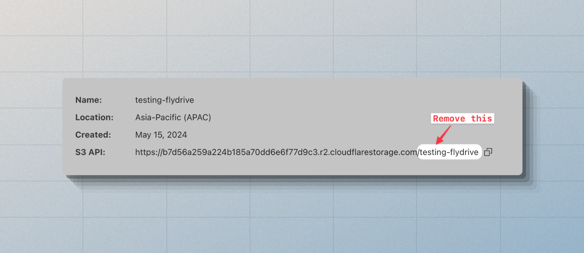

# Cloudflare R2

[Cloudflare R2](https://developers.cloudflare.com/r2/) is a S3 compatible storage service. Therefore, you can use the [S3Driver](https://github.com/flydrive-js/core/blob/develop/drivers/s3/driver.ts) to manage files on R2. Make sure to install the following peer dependencies in your project.

```sh
npm i @aws-sdk/s3-request-presigner @aws-sdk/client-s3
```

Once done, you can create an instance of the S3 Driver and use it as follows.

```ts
import { Disk } from 'flydrive'
import { S3Driver } from 'flydrive/drivers/s3'

const disk = new Disk(
  new S3Driver({
    credentials: {
      accessKeyId: 'R2_KEY',
      secretAccessKey: 'R2_SECRET',
    },

    // highlight-start
    /**
     * Make sure the endpoint does not include the
     * bucket name
     */
    endpoint: 'https://jg21.r2.cloudflarestorage.com',
    region: 'auto',
    supportsACL: false,
    // highlight-end

    bucket: 'R2_BUCKET',
    visibility: 'private',
  })
)
```

You may pass all the options accepted by the [@aws-sdk/client-s3](https://www.npmjs.com/package/@aws-sdk/client-s3) package to the `S3Driver`. However, the following options must always be defined when using Cloudflare R2.

<dl>

<dt>

supportsACL

</dt>

<dd>

Disable support for ACL. This is because R2 does not support/implement ACL commands. As a result, the `disk.getVisibility()` method will not perform an API call and return the `visibility` value from the config.

Similarly, the `disk.setVisibility()` method will result in a `NOOP`.

</dd>

<dt>

endpoint

</dt>

<dd>

Make sure to always define the `endpoint` of your Cloudflare R2 account. The endpoint should not include the bucket name.

</dd>

<dt>

region

</dt>

<dd>

The `region` must be set to `auto`. [Learn more](https://developers.cloudflare.com/r2/api/s3/api/#bucket-region)

</dd>

<dt>

bucket

</dt>

<dd>

The `bucket` option defines the S3 bucket for managing files.

</dd>

</dl>

## Creating public URLs

By default, Cloudflare R2 buckets are private and require a custom or managed domain mapping to [publicly access files](https://developers.cloudflare.com/r2/buckets/public-buckets/).

Once you have defined a domain for your bucket, you must register that domain as `cdnUrl` inside the service configuration to generate public URLs pointing to that domain. For example:

```ts
const disk = new Disk(
  new S3Driver({
    // highlight-start
    cdnUrl: 'https://pub-jg21.r2.dev',
    // highlight-end
    endpoint: 'https://jg21.r2.cloudflarestorage.com',
    bucket: 'testing-drive',
  })
)

const URL = await disk.getUrl('avatar.png')
console.log(URL) // https://pub-jg21.r2.dev/avatar.png
```

You may also create a public URL by defining a custom URL builder within the config. For example:

```ts
// title: Self-generating public URLs
const disk = new Disk(
  new S3Driver({
    bucket: 'testing-drive',
    endpoint: 'https://jg21.r2.cloudflarestorage.com',
    // insert-start
    urlBuilder: {
      async generateURL(key, bucket, s3Client) {
        return `https://some-custom-url/files/${bucket}/${key}`
      },
    },
    // insert-end
  })
)

const URL = await disk.getUrl('avatar.png')
console.log(URL) // https://some-custom-url/files/testing-drive/avatar.png
```

## Creating signed URLs

Signed URLs are created to provide time-based access to a private file hosted on Cloudflare R2. For example:

```ts
const disk = new Disk(new S3Driver({}))

const signedURL = await disk.getSignedUrl('invoice.pdf', {
  expiresIn: '30mins',
})
```

At the time of generating the signed URL, you can pass one of the following options along with the options accepted by [GetObjectCommand](https://docs.aws.amazon.com/AWSJavaScriptSDK/v3/latest/client/s3/command/GetObjectCommand/) class.

```ts
await disk.getSignedUrl('invoice.pdf', {
  expiresIn: '30mins',
  contentType: 'application/pdf',
  contentDisposition: 'attachment',

  /**
   * Additional options applicable for S3 only
   */
  ResponseCacheControl: 'max-age=604800',
})
```

## Having issues?

### Use S3 compatible credentials

When generating the R2 tokens, make sure to copy and use the S3-compatible access key and secret instead of the R2 token. Refer to the following screenshot for a visual cue.


### Endpoint should not include the bucket name

The R2 settings panel displays the endpoint with the bucket name. When registering the endpoint with FlyDrive, remove the bucket name.



### Define `cdnUrl` to publicly access files

Files stored inside R2 buckets are not publicly accessible by default. To create public URLs, you must create and assign a custom/managed subdomain to your bucket and register it as `cdnUrl` with FlyDrive config.
