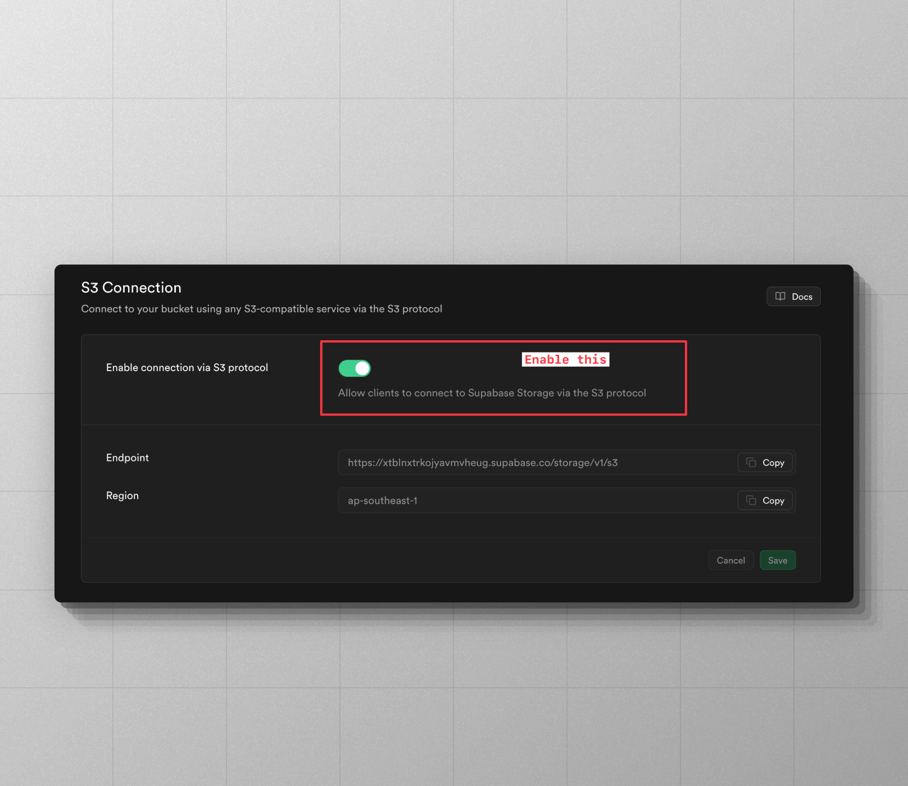

# Supabase Storage

Supabase Storage comes with an [S3 compatibility layer](https://supabase.com/docs/guides/storage/s3/compatibility). Therefore, you can use the [S3Driver](https://github.com/flydrive-js/core/blob/develop/drivers/s3/driver.ts) to manage files on Supabase. Make sure to install the following peer dependencies in your project.

```sh
npm i @aws-sdk/s3-request-presigner @aws-sdk/client-s3
```

Once done, you can create an instance of the S3 Driver and use it as follows.

```ts
import { Disk } from 'flydrive'
import { S3Driver } from 'flydrive/drivers/s3'

const disk = new Disk(
  new S3Driver({
    credentials: {
      accessKeyId: 'SUPABASE_KEY',
      secretAccessKey: 'SUPABASE_SECRET',
    },

    // highlight-start
    /**
     * Copy and paste the endpoint and region from the "S3 Connection" settings
     * section
     */
    endpoint: 'https://xtblnxtrkioiavmvheug.supabase.co/storage/v1/s3',
    region: 'ap-southeast-1',
    supportsACL: false,
    // highlight-end

    bucket: 'flydrive',
    visibility: 'private',
  })
)
```

You may pass all the options accepted by the [@aws-sdk/client-s3](https://www.npmjs.com/package/@aws-sdk/client-s3) package to the `S3Driver`. However, the following options must always be defined when using Supabase.

<dl>

<dt>

supportsACL

</dt>

<dd>

Disable support for ACL. This is because Supabase does not support/implement ACL commands. As a result, the `disk.getVisibility()` method will not perform an API call and return the `visibility` value from the config.

Similarly, the `disk.setVisibility()` method will result in a `NOOP`.

</dd>

<dt>

endpoint

</dt>

<dd>

Always define the `endpoint` of your Supabase storage project. Grab the `endpoint` from the **S3 Connection** settings section.



</dd>

<dt>

region

</dt>

<dd>

Specify the region for the superbase storage. You can grab the `region` from the **S3 Connection** settings section.

</dd>

<dt>

bucket

</dt>

<dd>

The `bucket` option defines the Supabase bucket for managing files.

</dd>

</dl>

## Creating public URLs

When creating the bucket on Supabase, mark it as `public`. Next, specify the bucket URL as the `cdnUrl` inside the service configuration. The `cdnUrl` must include the bucket name and have the trailing slash `/`.

```ts
const disk = new Disk(
  new S3Driver({
    // highlight-start
    cdnUrl: 'https://xtblnxtrkioiavmvheug.supabase.co/storage/v1/object/public/flydrive/',
    // highlight-end
    endpoint: 'https://xtblnxtrkioiavmvheug.supabase.co/storage/v1/s3',
    bucket: 'flydrive',
  })
)

const URL = await disk.getUrl('avatar.png')
console.log(URL) // https://xtblnxtrkioiavmvheug.supabase.co/storage/v1/object/public/flydrive/avatar.png
```

You may also create a public URL by defining a custom URL builder within the config. For example:

```ts
// title: Self-generating public URLs
const disk = new Disk(
  new S3Driver({
    bucket: 'flydrive',
    endpoint: 'https://xtblnxtrkioiavmvheug.supabase.co/storage/v1/s3',
    // insert-start
    urlBuilder: {
      async generateURL(key, bucket, s3Client) {
        return `https://xtblnxtrkioiavmvheug.supabase.co/storage/v1/object/public/${bucket}/${key}`
      },
    },
    // insert-end
  })
)

const URL = await disk.getUrl('avatar.png')
console.log(URL) // https://xtblnxtrkioiavmvheug.supabase.co/storage/v1/object/public/flydrive/avatar.png
```

## Creating signed URLs

Signed URLs are created to provide time-based access to a private file hosted on Supabase storage. For example:

```ts
const disk = new Disk(new S3Driver({}))

const signedURL = await disk.getSignedUrl('invoice.pdf', {
  expiresIn: '30mins',
})
```

At the time of generating the signed URL, you can pass one of the following options along with the options accepted by [GetObjectCommand](https://docs.aws.amazon.com/AWSJavaScriptSDK/v3/latest/client/s3/command/GetObjectCommand/) class.

```ts
await disk.getSignedUrl('invoice.pdf', {
  expiresIn: '30mins',
  contentType: 'application/pdf',
  contentDisposition: 'attachment',

  /**
   * Additional options applicable for S3 only
   */
  ResponseCacheControl: 'max-age=604800',
})
```

## Having issues?

### Enable S3 compatibility mode

When using Supabase storage with FlyDrive, enable the S3 compatibility mode within the Supabase dasbhoard under project settings.


### Define `cdnUrl` to publicly access files

To create public URLs, specify the `cdnUrl` pointing to your S3 bucket.

```
https://<project-id>.supabase.co/storage/v1/object/public/<bucket-name>/
```

### Use the `put` method instead of `putStream`.

Many users have reported that the `putStream` method does not reliably work with Supabase, resulting in broken images. Therefore, you must use the `put` method instead of a stream to create the files.
